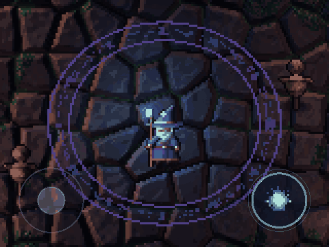
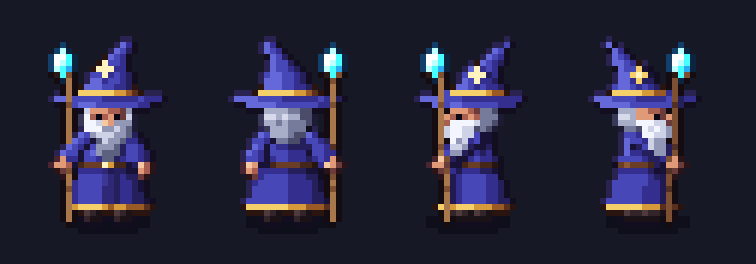
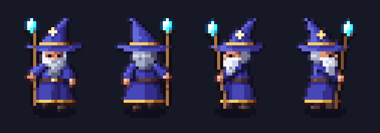
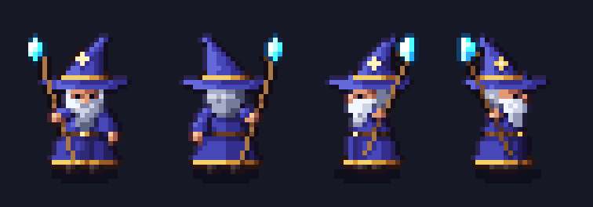
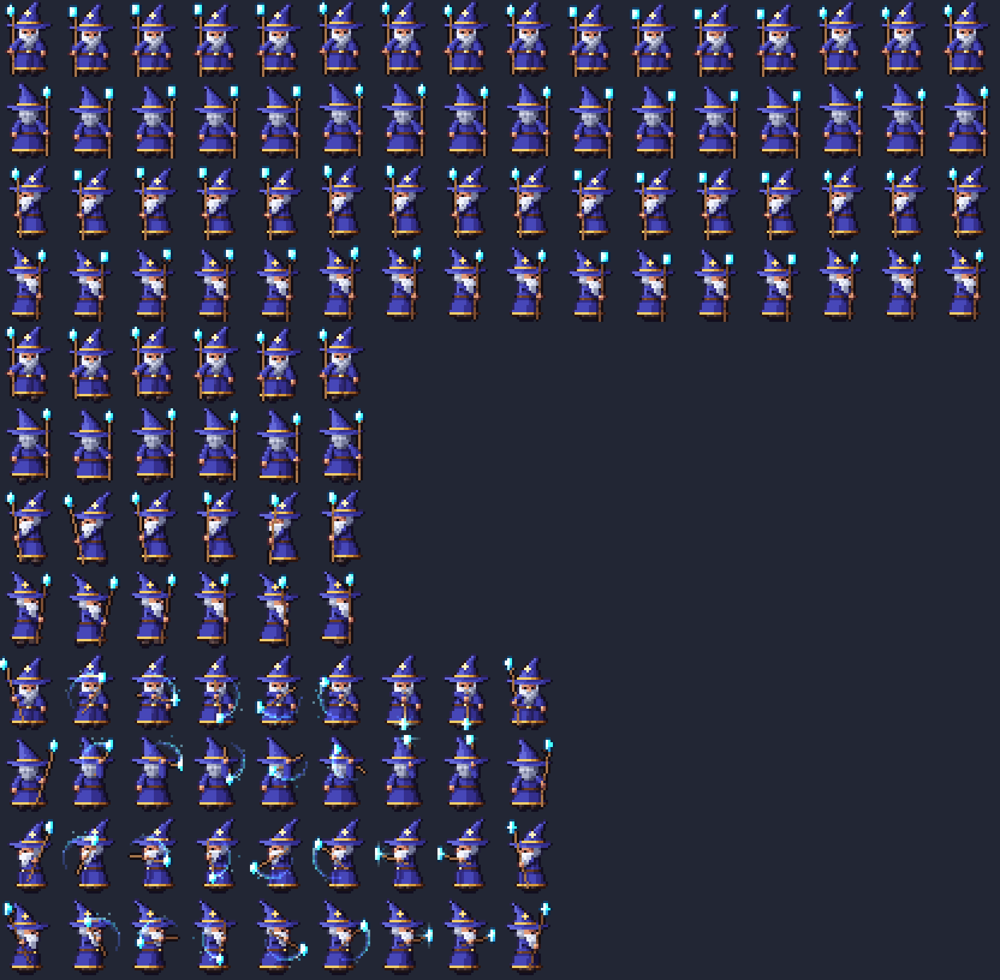

# Pixel Battle

A mobile-first, top-down pixel-art PvE game: walk with the joystick on the left, cast with the buttons on the right. Built with Phaser 3, TypeScript and Vite, so it deploys to Vercel as a static site.



## The wizard

All art is generated in code. There are no image files in the game. The wizard fits in a 24x32 frame and has:

- **Idle** (front, back, both sides): breathing, a swaying hat tip, a hovering and pulsing crystal, and an occasional blink
- **Walk** in all four directions: a 6-frame cycle with body bob, stepping boots, robe sway and a swinging staff
- **Cast**: a wind-up, a staff twirl where the crystal carves a ribbon of light, then a release that fires an energy ball in the direction you aim

| Idle | Walk | Cast |
| --- | --- | --- |
|  |  |  |

### How the art is made

`src/art/pixel.ts` is a small pixel-art engine. Parts such as the robe, beard, hat and staff are drawn as shapes that also carry a surface normal (cylinder, sphere, cone). Each frame is rendered into three layers:

- **Diffuse**: palette-ramp shading from a top-left key light, selective outlines (lighter on the lit side), and contact shadows where one part overlaps another
- **Normal map**: used by Phaser's Light2D pipeline, so torches, the staff crystal and the energy ball light the wizard from the correct side
- **Emissive**: the crystal, magic trails and projectiles glow on their own and are drawn additively

Animations in `src/art/wizard.ts` are lists of poses (lift, breath, foot offsets, staff transform, trail) fed to one draw function per direction. Right-facing frames are mirrored from the left-facing ones, with their normals flipped.



## Running it

```bash
npm install
npm run dev      # open the printed URL on your phone (same Wi-Fi) or desktop
npm run build    # static build in dist/
npm run sheet    # write zoomed sprite sheets to sheets/ for reviewing the art
```

Controls: on a touch screen, use the left joystick and the right button. On desktop, use WASD or the arrow keys, and Space or J to cast.

## Deploying

Import the repo in Vercel. It detects Vite automatically (build `npm run build`, output `dist`). Multiplayer will need a separate realtime server later, because Vercel does not host long-lived WebSocket servers.
