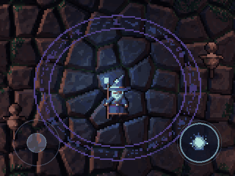
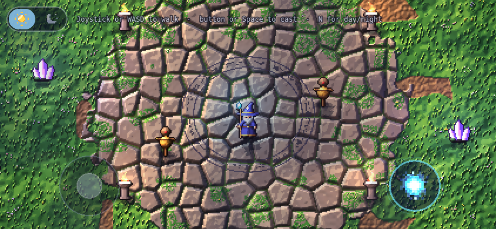
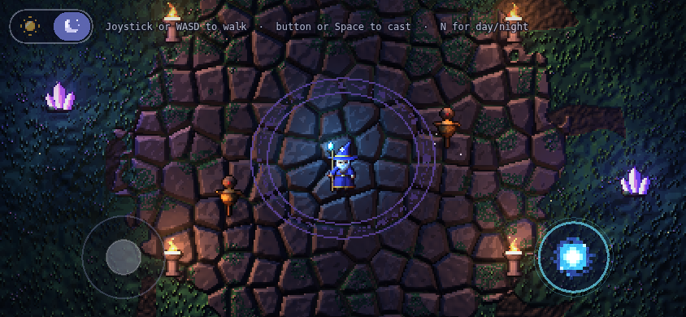
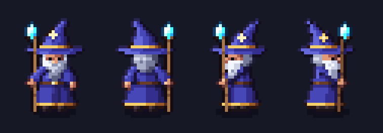
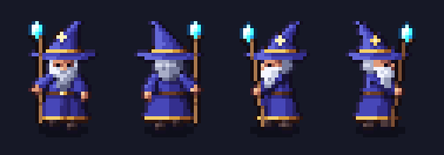
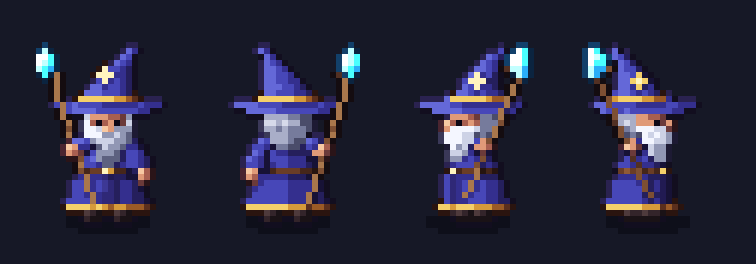
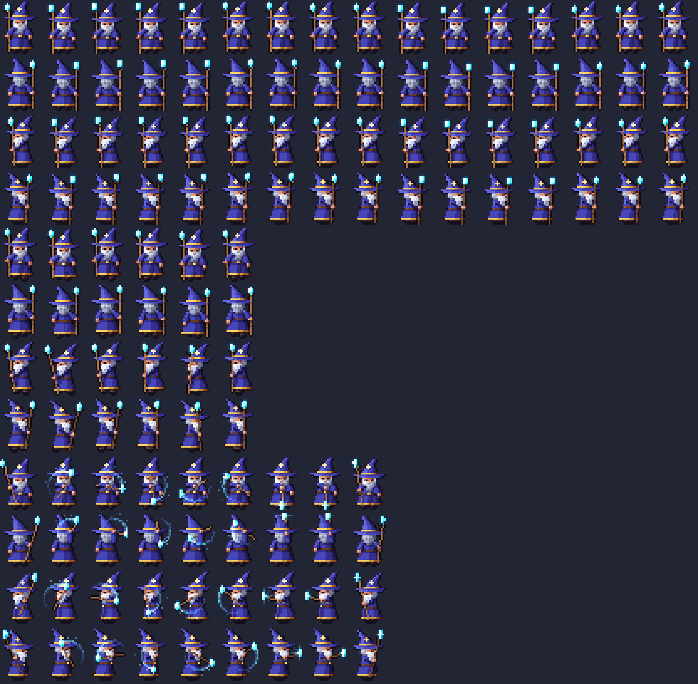
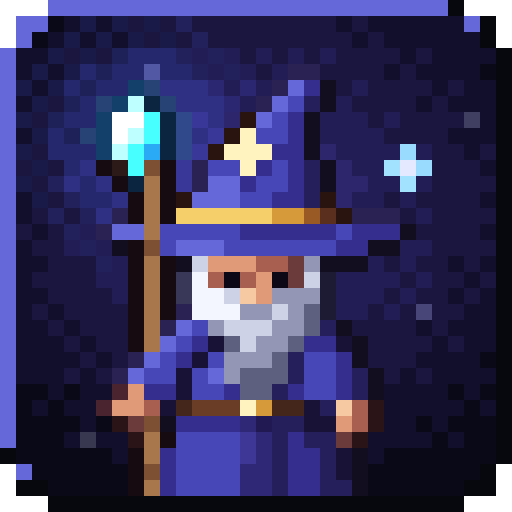

# Myths and Legends

A mobile-first, top-down pixel-art PvE game: walk with the joystick on the left, fight with the buttons on the right. Built with Phaser 3, TypeScript and Vite, so it deploys to Vercel as a static site. Every sprite and every sound is made in code.



## Heroes

Twelve classes: Mage, Warrior, Jedi, Alchemist, Ranger, Duelist, Necromancer, Mystic, Automaton, Phantom, Inventor and Nature. A class gathers several characters (the Mage is an Arcanist, a Pyromancer, a Tidecaller, a Timekeeper or a Paradox), each with its own stats and abilities, and every character has skins that change its looks. Each hero has an attack, an ability and a Special, paid for with energy gathered by slaying monsters.

## Arenas

- **Runestone Clearing**: home, with training dummies and the Rune Temple, where Nyx turns spare gear into dust and Tharn spends dust upgrading epic and legendary pieces
- **Sunken Garden**: ruins under giant flowers whose blooms grant buffs
- **Spirit Dungeon**, **Elementinho Temple** and **the Glimmerdeep**: dungeons ending in bosses that drop their own gear sets
- **Cosmos Arena**: the Astral Warden, alone
- **Floating Island**: a ring for 1v1 duels

Monsters drop potions and gear (64 pieces in six slots). Logging in keeps what you find on every device. Online, up to four friends play together by room code, or two duel.

## Day and night

The sun and moon toggle in the top-left corner (or the N key) fades the scene between two moods:

- **Day**: a warm sun from the upper left, blue sky light on upward-facing surfaces, a meadow with wildflowers, drifting cloud shadows, shafts of sunlight, floating pollen, and cast shadows under the wizard and props.
- **Night**: cool moonlight from the upper right, torches and crystals doing most of the lighting, the rune circle glowing, and fireflies.

| Day | Night |
| --- | --- |
|  |  |

The lighting runs through a custom `Lit` pipeline (`src/game/LitPipeline.ts`). It extends Phaser's Light2D with a directional sun and a sky/bounce ambient term, because Light2D alone only has point lights.

## The wizard

All art is generated in code. There are no image files in the game. The wizard fits in a 24x32 frame and has:

- **Idle** (front, back, both sides): breathing, a swaying hat tip, a hovering and pulsing crystal, and an occasional blink
- **Walk** in all four directions: a 6-frame cycle with body bob, stepping boots, robe sway and a swinging staff
- **Cast**: a wind-up, a staff twirl where the crystal carves a ribbon of light, then a release that fires an energy ball in the direction you aim

| Idle | Walk | Cast |
| --- | --- | --- |
|  |  |  |

### How the art is made

`src/art/pixel.ts` is a small pixel-art engine. Parts such as the robe, beard, hat and staff are drawn as shapes that also carry a surface normal (cylinder, sphere, cone). Each frame is rendered into three layers:

- **Diffuse**: palette-ramp shading from a top-left key light, selective outlines (lighter on the lit side), and contact shadows where one part overlaps another
- **Normal map**: used by Phaser's Light2D pipeline, so torches, the staff crystal and the energy ball light the wizard from the correct side
- **Emissive**: the crystal, magic trails and projectiles glow on their own and are drawn additively

Animations in `src/art/wizard.ts` are lists of poses (lift, breath, foot offsets, staff transform, trail) fed to one draw function per direction. Right-facing frames are mirrored from the left-facing ones, with their normals flipped.



## App icon and install



The game is a PWA: on Android, Chrome offers an **Install** button (top right); on iPhone, use Share > Add to Home Screen. Installed, it opens like an app, and it keeps working offline because a service worker caches the whole build. On a phone the loading screen ends on Tap anywhere to start (drawn sideways while the phone is upright); that tap goes fullscreen and, on Android, locks to landscape. Held upright, the game asks you to turn the phone sideways (tap to play in portrait anyway).

The icon is drawn in code too (`src/art/icon.ts`): the wizard's portrait against a dithered night sky, lit by his crystal. `scripts/pwa.ts` is a Vite plugin that renders every icon size, writes the manifest and generates the service worker at build time, so there are no icon files to keep in sync. Maskable icons use a wider grid so the crystal survives a round mask.

## Running it

```bash
npm install
npm run dev      # open the printed URL on your phone (same Wi-Fi) or desktop
npm run build    # static build in dist/
npm run sheet    # write zoomed sprite sheets to sheets/ for reviewing the art
npm run icons    # write every app icon to sheets/icons/ for reviewing
```

Controls: on a touch screen, use the left joystick and the buttons on the right (drag a button to aim it; a tap aims at the nearest enemy). On desktop: WASD or the arrow keys to walk, left click or J to attack, right click, K or Shift for the ability, Space for the Special, 1 to 3 for the hotbar, N to switch day and night, and Esc to pause.

## Deploying

Import the repo in Vercel. It detects Vite automatically (build `npm run build`, output `dist`). Multiplayer will need a separate realtime server later, because Vercel does not host long-lived WebSocket servers.
